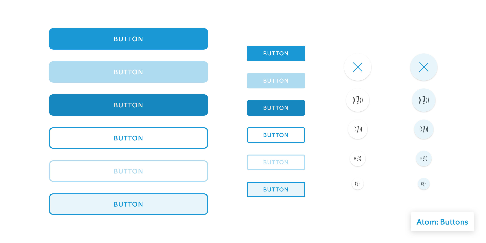
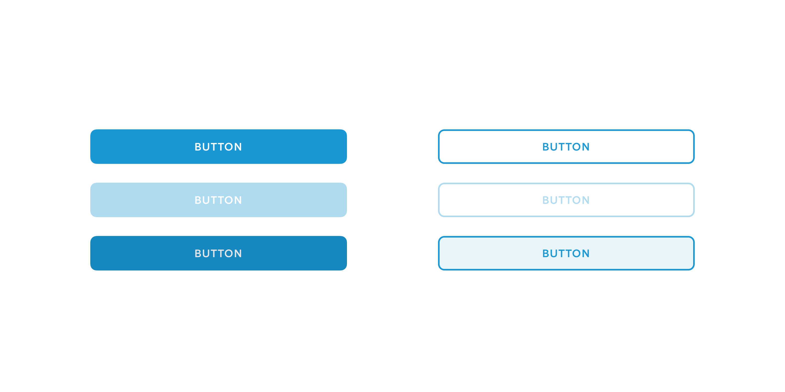
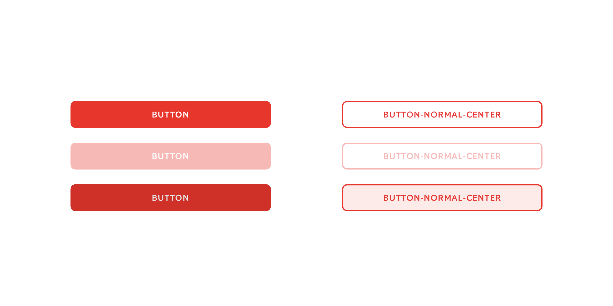
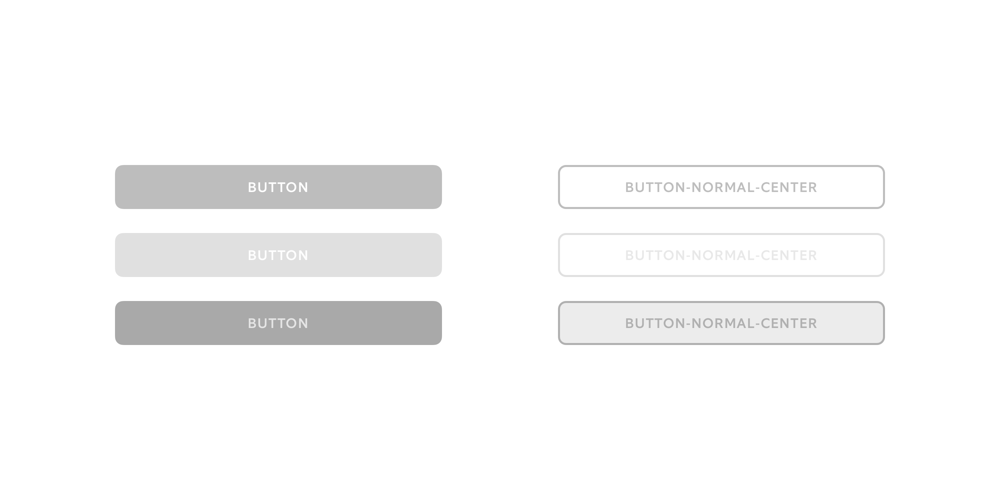
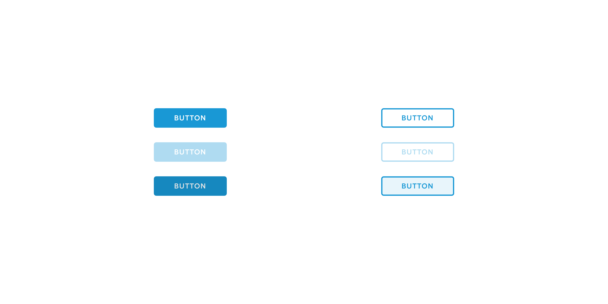
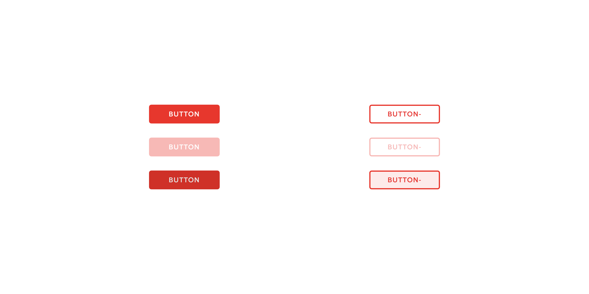
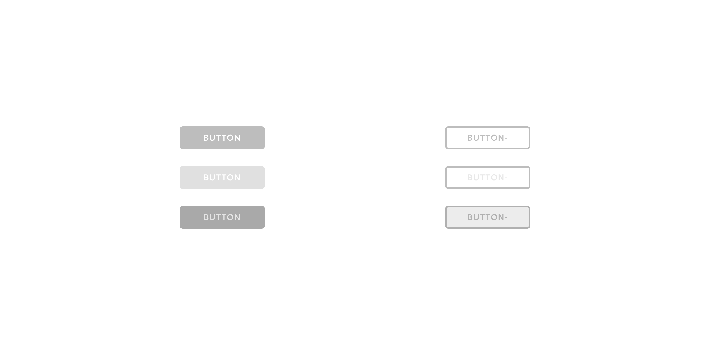

# 04 Button

## Regular

[iOS](https://app.zeplin.io/project/5a395997e8354b6a0e3b9c73/dashboard?seid=5ab1467e820e70df6b3fa109) \| [Android](https://app.zeplin.io/project/5a39599115b7f3ec5f3326a0/dashboard?seid=5a986316b46942419ccc6936)

## Small

[iOS](https://app.zeplin.io/project/5a395997e8354b6a0e3b9c73/dashboard?seid=5ab1467e820e70df6b3fa109) \| [Android](https://app.zeplin.io/project/5a39599115b7f3ec5f3326a0/dashboard?seid=5a986316b46942419ccc6936)

