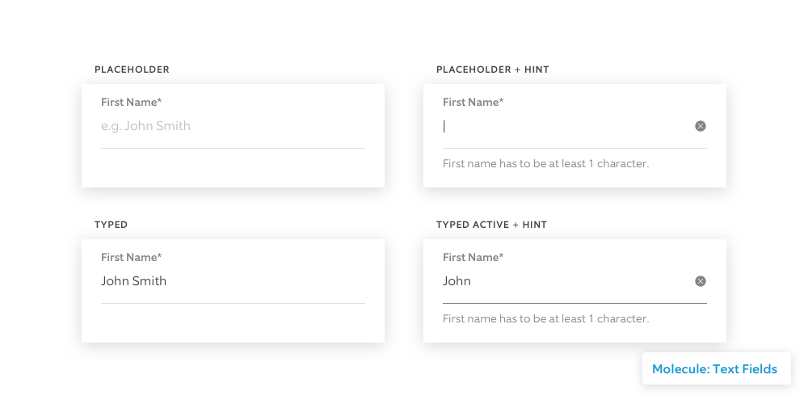
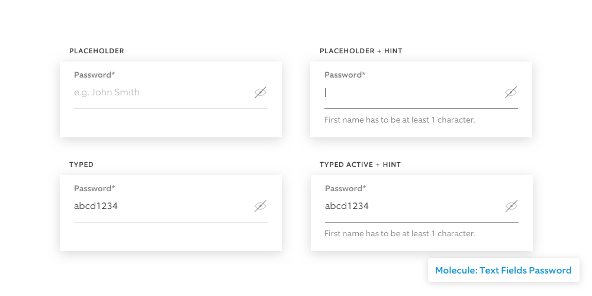
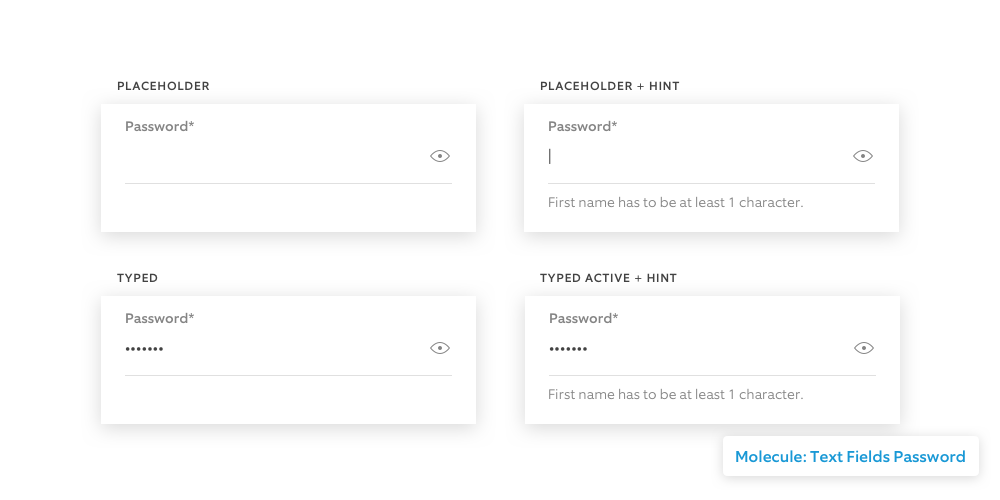
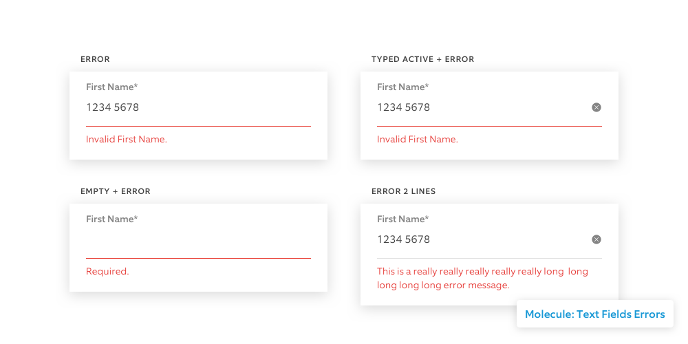

# 05 Text Fields

Text Input elements are the atoms that compose [Text Fields](text-fields.md).

**Text-Input/3.Label-Caption** is also used in designing cells and tables. \(optional\)

We're currently reviewing a case where iOS and Android match the same placeholder design with both sides of developers.

**Text-Input/3.Label-Hint** and **Text-Input/3.Label-Error** are used to describe instruction or error messages. It pushes down the containers below.

