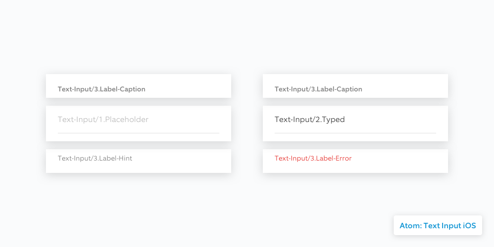
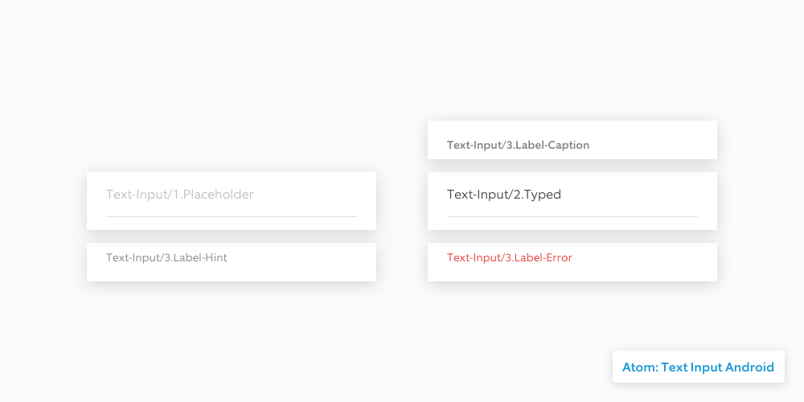

# Text Inputs

Text Input elements are the atoms that compose [Text Fields](text-fields.md).

**Text-Input/3.Label-Caption** is also used in designing cells and tables. \(optional\)

We're currently reviewing a case where iOS and Android match the same placeholder design with both sides of developers.

**Text-Input/3.Label-Hint** and **Text-Input/3.Label-Error** are used to describe instruction or error messages. It pushes down the containers below.

## iOS

**Zeplin**

[iOS](https://github.com/kevin-ring/ring-design-system/tree/8849159db6764601017289d41b84d60f348c1d98/zpl.io/2vBXeLv/README.md)

## Android

**Zeplin**

[Android](https://github.com/kevin-ring/ring-design-system/tree/8849159db6764601017289d41b84d60f348c1d98/zpl.io/2jlKxyA/README.md)

**Resources**

[https://material.io/components/android/catalog/text-input-layout/](https://material.io/components/android/catalog/text-input-layout/)

[https://material.io/guidelines/components/text-fields.html\#text-fields-states](https://material.io/guidelines/components/text-fields.html#text-fields-states)

