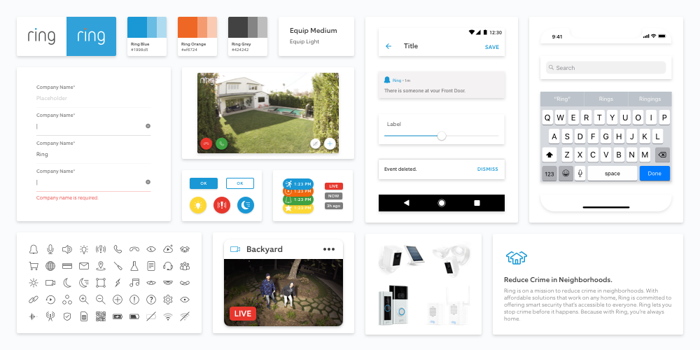

# Getting Started

## Gettings Started

At Ring, we believe in design that transcends aesthetics. **Our design starts with our highest hope of our neighbors' experience.**

**Designing a neighbor experience is not an ordinary user experience or interface design.** It’s a day-to-day experience with your loving family. It’s a borderless experience whether you're at home, work or even in foreign countries. It's a community experience where you can share your stories with hundreds and thousands in your neighborhood.

**Ring Design System** is our small step to transcribe what we have learned, are learning, and will learn from our neighbors.

### Principles

#### Usability

* Be mindful of neighbor's unpredictable environment such as slow internet speed and large estate.
* Be mindful of neighbor's unfamiliarity with technology as most of our users are the first adopter of technology.
* Be mindful of neighbor's unperceptive nature to learn something new as most of our users are already too busy. \(i.e. we can't make them think twice.\)

#### Scalability

* Always be prepared to scale internationally with regulation and translation.
* Always be prepared to support all client types - iOS, Android, macOS, Windows, and Web.
* Always be prepared to accommodate for all verticals at Ring - Ring HQ, Alarm and Neighborhood.

#### Adaptability

* A feature design process should anticipate multiple iterations based on feedback from multiple points.
* All user interface components are encouraged to be broken and experimented to meet any designer's needs.
* All user interface or experience should be adaptable for a variety of feature types. \(e.g. butterbars and snackbars\)

#### TLDR;

* **Don't be too cute.**
* **Break and experiment with the existing user interface components.**
* **Don't forget the edge cases of different screen sizes and text length per translation. **

### **Targets**

#### iOS

* **SUPPORT** iOS 9 and above.
* **DESIGN** for iPhone 6/7/8 first. \(375pt x 667pt @1x\)
* **TEST** the design on iPhone SE and APPLY the "512 rule" on iPads.

#### Android

* **SUPPORT** Android 4.4 and above.
* **DESIGN** for Google Pixel first. \(360pt x 640pt @mdpi\)
* **APPLY** the "512 rule" on Tablets.

#### macOS

* **DESIGN** for 1440px x 900px.
* **ANTICIPATE** retina-resolution assets.
* **EXPECT** delayed releases of features behind iOS and Android.

#### Windows

#### Web

### Environment

#### Sketch

* [Learn more](https://sketchapp.com)
* [Sketch Library](https://www.sketchapp.com/docs/libraries/)
* [Sketch Runner](https://www.gitbook.com/book/kevinsmtenn/ring-design-system/edit#) \(highly recommend\)
* [Sketch Cache Cleaner](https://yo-op.github.io/sketchcachecleaner/) \(recommend\)
* [Rename-It](https://rodi01.github.io/RenameIt/)
* [Magic Mirror 3](https://magicsketch.io/mirror/)
* [Sketch Measure](https://github.com/utom/sketch-measure)

#### Zeplin

* [Learn more](https://www.zeplin.io)
* [Download macOS app](https://zpl.io/download-mac)

#### Abstract

* [Learn more](abstract.md)
* [Download macOS app](https://app.goabstract.com/download)

#### PaintCode

* [Learn more](https://www.paintcodeapp.com)
* [Ring StyleKit 1.3](https://www.dropbox.com/sh/03ftllw7ps16te5/AACv8Pr-Qa0hJkDv309x7uQ3a?dl=0)

