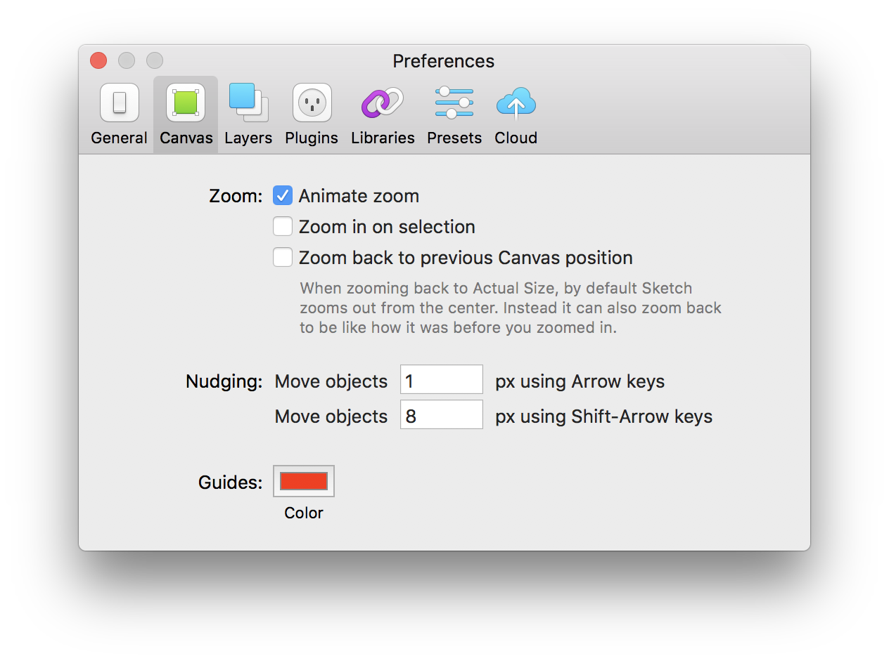

# Sketch

## Setting up the environment

### Step 1: Getting the goodies

In "Ring App/Design/Design System" dropbox folder, you will find the following:

1. Ring type logo in SVG and PNG formats.
2. Imagery of Ring products, lifestyle and POV \(point of view\).
3. Types of Equip, Roboto, SF Pro, SF Compact and Icon Font.
4. Icons in PaintCode, Sketch and SVG formats.
5. Sketch Resources including Facebook devices, plugins and UI kits.

### Step 2: Getting on the same page with other designers

In Sketch, press cmd + comma "," to open the preferences panel.

1. In Canvas preferences, set the "Nudging: move objects 10 px using Shift-Arrow keys" to "8 px".
2. In Libraries preferences, disable the iOS UI Design from Sketch Library to disable duplicate iOS UI components in RDS.

### Step 3: Plugging in the plugins

* [Sketch Runner](https://www.gitbook.com/book/kevinsmtenn/ring-design-system/edit#) \(highly recommended\)
* [Sketch Cache Cleaner](https://yo-op.github.io/sketchcachecleaner/) \(recommended\)
* [Rename-It](https://rodi01.github.io/RenameIt/) \(optional\)
* [Magic Mirror 3](https://magicsketch.io/mirror/) \(optional\)
* [Sketch Measure](https://github.com/utom/sketch-measure) \(optional\)

### Step 4: Updating Sketch

Although we love new tools and features from everyone, for stability reasons, we have a "x.1" rule where we don't update to the Master version right away. i.e. Sketch releases 49 to the public. Everyone should select "Skip this version" and wait for 49.1 to come out.

1. This practice increases the stability of our collaboration in Abstract.
2. This practice buys us time to update our Sketch plugins and other apps that work with Sketch.
3. This practice prevents us from losing productivity while working on features.

