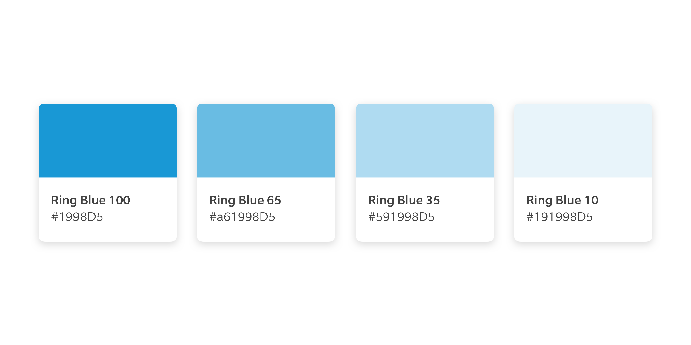
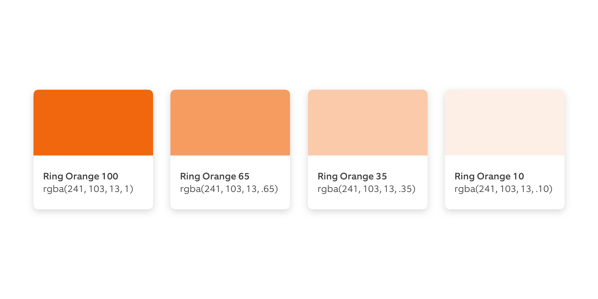
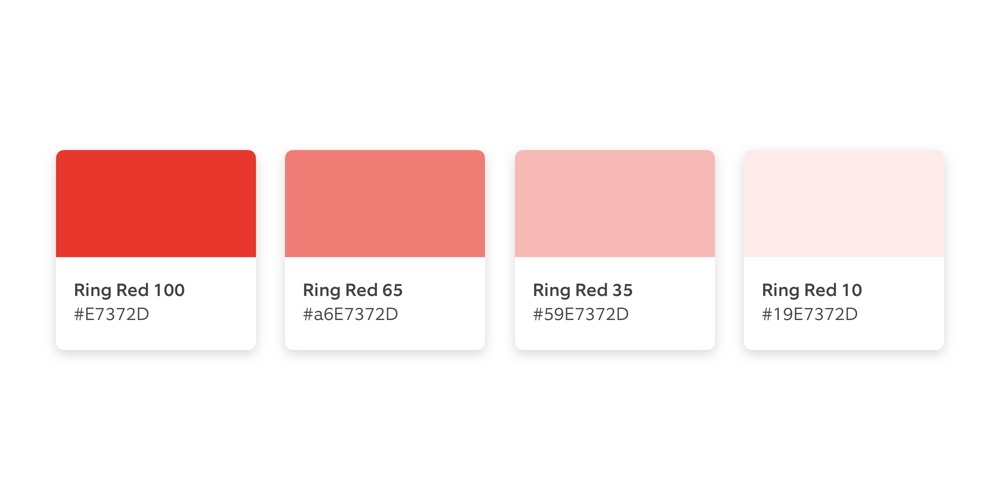
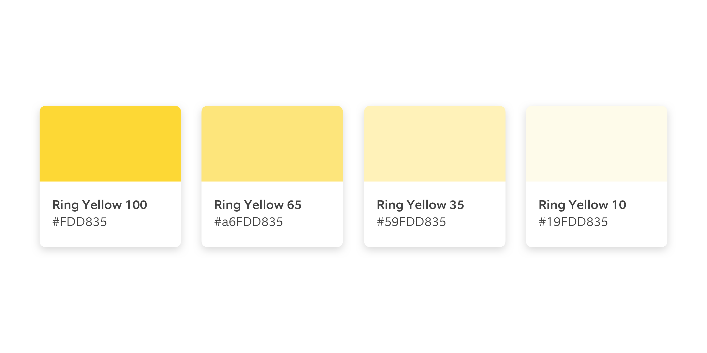
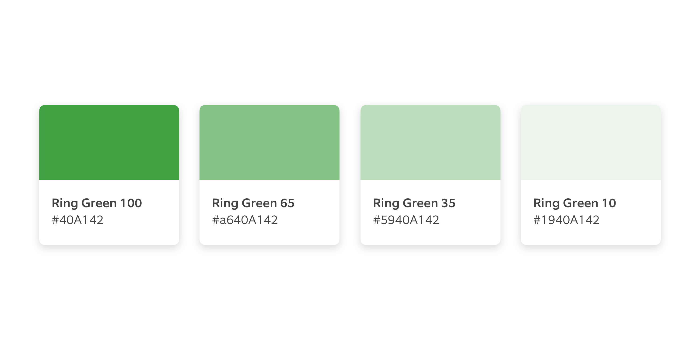
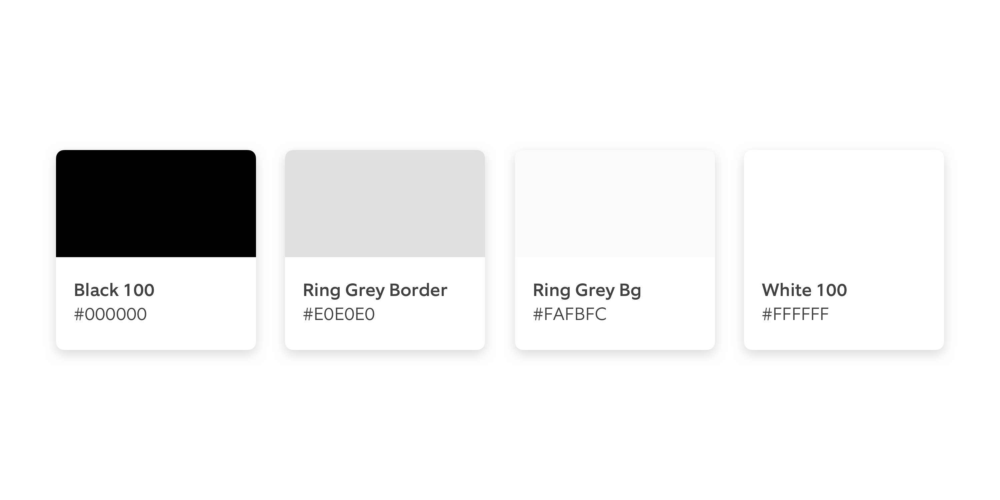

# 01 Color

## Primary Colors

### Ring Blue



| **Name** | **HEX** | **RGB** |
| :--- | :--- | :--- |
| Ring Blue 100 | \#1998d5 | rgb\(25, 152, 213\) |
| Ring Blue 65 | \#a61998d5 | rgb\(25, 152, 213, 0.65\) |
| Ring Blue 35 | \#591998d5 | rgb\(25, 152, 213, 0.35\) |
| Ring Blue 10 or Overlay | \#191998d5 | rgb\(25, 152, 213, 0.10\) |

### Ring Orange



| **Name** | **HEX** | **RGB** |
| :--- | :--- | :--- |
| Ring Orange 100 | \#f1670d | rgb\(241, 103, 13\) |
| Ring Orange 65 | \#a6f1670d | rgb\(241, 103, 13, 0.65\) |
| Ring Orange 35 | \#59f1670d | rgb\(241, 103, 13, 0.35\) |
| Ring Orange 10 or Overlay | \#19f1670d | rgb\(241, 103, 13, 0.10\) |

## Ring Red



| **Name** | **HEX** | **RGB** |
| :--- | :--- | :--- |
| Ring Red 100 | \#e7372d | rgb\(231, 55, 45\) |
| Ring Red 65 | \#a6e7372d | rgb\(231, 55, 45, 0.65\) |
| Ring Red 35 | \#59e7372d | rgb\(231, 55, 45, 0.35\) |
| Ring Red 10 or Overlay | \#19e7372d | rgb\(231, 55, 45, 0.10\) |

### Ring Yellow



| Name | **HEX** | **RGB** |
| :--- | :--- | :--- |
| Ring Yellow 100 | \#fdd835 | rgb\(253, 216, 53\) |
| Ring Yellow 65 | \#a6fdd8d5 | rgb\(253, 216, 53, 0.65\) |
| Ring Yellow 35 | \#59fdd835 | rgb\(253, 216, 53, 0.35\) |
| Ring Yellow 10 or Overlay | \#19fdd8d5 | rgb\(253, 216, 53, 0.10\) |

### Ring Green



| **Name** | **HEX** | **RGB** |
| :--- | :--- | :--- |
| Ring Green 100 | \#40a142 | rgb\(64, 161, 66\) |
| Ring Green 65 | \#a60a142 | rgb\(64, 161, 66, 0.65\) |
| Ring Green 35 | \#5940a142 | rgb\(64, 161, 66, 0.35\) |
| Ring Green 10 or Overlay | \#1940a142 | rgb\(64, 161, 66, 0.10\) |

## Monochromatic Colors

### Ring Grey


| **Name** | **HEX** | **RGB** |
| :--- | :--- | :--- |
| Ring Grey 100 | \#424242 | rgb\(66, 66, 66\) |
| Ring Grey 65 | \#a6424242 | rgb\(66, 66, 66, 0.65\) |
| Ring Grey 35 | \#59424242 | rgb\(66, 66, 66, 0.35\) |
| Ring Grey 10 | \#19424242 | rgb\(66, 66, 66, 0.10\) |

### Ring Black-White



| **Name** | **HEX** | **RGB** |
| :--- | :--- | :--- |
| Black 100 | \#000000 | rgb\(0, 0, 0\) |
| Ring Grey Border | \#e0e0e0 | rgb\(224, 224, 224\) |
| Ring Grey Background | \#fafbfc | rgb\(250, 251, 252\) |
| White 100 | \#ffffff | rgb\(255, 255, 255\) |

### Color Palette

### iOS, Swift 4

```text
extension UIColor {

  @nonobjc class var ringBlue100: UIColor {
    return UIColor(red: 25.0 / 255.0, green: 152.0 / 255.0, blue: 213.0 / 255.0, alpha: 1.0)
  }

  @nonobjc class var ringBlue35: UIColor {
    return UIColor(red: 25.0 / 255.0, green: 152.0 / 255.0, blue: 213.0 / 255.0, alpha: 0.35)
  }

  @nonobjc class var ringOrange100: UIColor {
    return UIColor(red: 241.0 / 255.0, green: 103.0 / 255.0, blue: 13.0 / 255.0, alpha: 1.0)
  }

  @nonobjc class var ringRed100: UIColor {
    return UIColor(red: 231.0 / 255.0, green: 55.0 / 255.0, blue: 45.0 / 255.0, alpha: 1.0)
  }

  @nonobjc class var ringYellow100: UIColor {
    return UIColor(red: 253.0 / 255.0, green: 216.0 / 255.0, blue: 53.0 / 255.0, alpha: 1.0)
  }

  @nonobjc class var ringOrange35: UIColor {
    return UIColor(red: 241.0 / 255.0, green: 103.0 / 255.0, blue: 13.0 / 255.0, alpha: 0.35)
  }

  @nonobjc class var ringRed35: UIColor {
    return UIColor(red: 231.0 / 255.0, green: 55.0 / 255.0, blue: 45.0 / 255.0, alpha: 0.35)
  }

  @nonobjc class var ringYellow35: UIColor {
    return UIColor(red: 253.0 / 255.0, green: 216.0 / 255.0, blue: 53.0 / 255.0, alpha: 0.35)
  }

  @nonobjc class var ringGreen35: UIColor {
    return UIColor(red: 64.0 / 255.0, green: 161.0 / 255.0, blue: 66.0 / 255.0, alpha: 0.35)
  }

  @nonobjc class var black100: UIColor {
    return UIColor(white: 0.0, alpha: 1.0)
  }

  @nonobjc class var ringGreen100: UIColor {
    return UIColor(red: 64.0 / 255.0, green: 161.0 / 255.0, blue: 66.0 / 255.0, alpha: 1.0)
  }

  @nonobjc class var ringGrey100: UIColor {
    return UIColor(white: 66.0 / 255.0, alpha: 1.0)
  }

  @nonobjc class var ringGrey65: UIColor {
    return UIColor(white: 66.0 / 255.0, alpha: 0.65)
  }

  @nonobjc class var ringGrey35: UIColor {
    return UIColor(white: 66.0 / 255.0, alpha: 0.35)
  }

  @nonobjc class var ringGreyBorder: UIColor {
    return UIColor(white: 224.0 / 255.0, alpha: 1.0)
  }

  @nonobjc class var ringGreyBackground: UIColor {
    return UIColor(red: 250.0 / 255.0, green: 251.0 / 255.0, blue: 252.0 / 255.0, alpha: 1.0)
  }

  @nonobjc class var white100: UIColor {
    return UIColor(white: 1.0, alpha: 1.0)
  }

  @nonobjc class var white65: UIColor {
    return UIColor(white: 1.0, alpha: 0.65)
  }

  @nonobjc class var white35: UIColor {
    return UIColor(white: 1.0, alpha: 0.35)
  }

  @nonobjc class var ringOrange10: UIColor {
    return UIColor(red: 241.0 / 255.0, green: 103.0 / 255.0, blue: 13.0 / 255.0, alpha: 0.1)
  }

  @nonobjc class var ringBlue10: UIColor {
    return UIColor(red: 25.0 / 255.0, green: 152.0 / 255.0, blue: 213.0 / 255.0, alpha: 0.1)
  }

  @nonobjc class var ringGreen10: UIColor {
    return UIColor(red: 64.0 / 255.0, green: 161.0 / 255.0, blue: 66.0 / 255.0, alpha: 0.1)
  }

  @nonobjc class var ringRed10: UIColor {
    return UIColor(red: 231.0 / 255.0, green: 55.0 / 255.0, blue: 45.0 / 255.0, alpha: 0.1)
  }

  @nonobjc class var ringYellow10: UIColor {
    return UIColor(red: 253.0 / 255.0, green: 216.0 / 255.0, blue: 53.0 / 255.0, alpha: 0.1)
  }

}

// Sample text styles

extension UIFont {

  class var header: UIFont {
    return UIFont.systemFont(ofSize: 24.0, weight: .bold)
  }

}
```

### Android, XML

```text
<resources>
  <color name="ring_blue_100">#1998d5</color>
  <color name="ring_blue_35">#591998d5</color>
  <color name="ring_orange_100">#f1670d</color>
  <color name="ring_orange_35">#59f1670d</color>
  <color name="ring_red_35">#59e7372d</color>
  <color name="ring_yellow_100">#fdd835</color>
  <color name="ring_yellow_35">#59fdd835</color>
  <color name="ring_red_100">#e7372d</color>
  <color name="ring_green_100">#40a142</color>
  <color name="black_100">#000000</color>
  <color name="ring_green_35">#5940a142</color>
  <color name="ring_grey_65">#a6424242</color>
  <color name="ring_grey_border">#e0e0e0</color>
  <color name="ring_grey_100">#424242</color>
  <color name="ring_grey_35">#59424242</color>
  <color name="white_35">#59ffffff</color>
  <color name="ring_grey_background">#fafbfc</color>
  <color name="white_100">#ffffff</color>
  <color name="white_65">#a6ffffff</color>
  <color name="ring_orange_10">#19f1670d</color>
  <color name="ring_red_10">#19e7372d</color>
  <color name="ring_blue_10">#191998d5</color>
  <color name="ring_yellow_10">#19fdd835</color>
  <color name="ring_green_10">#1940a142</color>
</resources>
```

