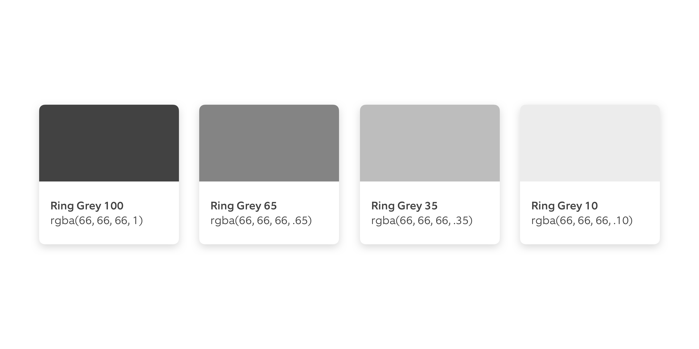
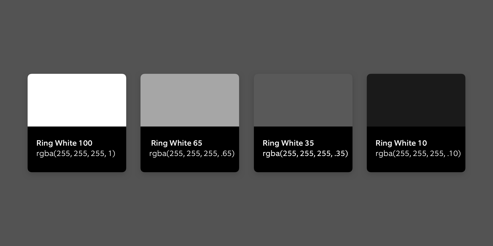
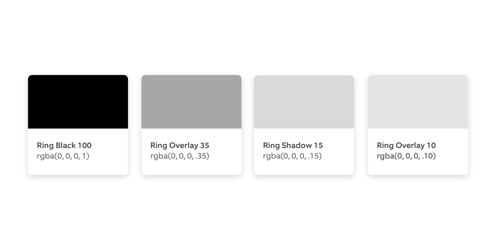

# 01 Color

## Design

### 01-Blue


| **Name** | **HEX** | **RGBA** |
| :--- | :--- | :--- |
| Ring Blue 100 | \#1998d5 | rgba\(25, 152, 213, 1\) |
| Ring Blue 65 | \#a61998d5 | rgba\(25, 152, 213, .65\) |
| Ring Blue 35 | \#591998d5 | rgba\(25, 152, 213, .35\) |
| Ring Blue 10 | \#a1998d5 | rgba\(25, 152, 213, .10\) |

### 02-Orange


| **Name** | **HEX** | **RGBA** |
| :--- | :--- | :--- |
| Ring Orange 100 | \#f1670d | rgba\(241, 103, 13, 1\) |
| Ring Orange 65 | \#a6f1670d | rgba\(241, 103, 13, .65\) |
| Ring Orange 35 | \#59f1670d | rgba\(241, 103, 13, .35\) |
| Ring Orange 10 | \#1af1670d | rgba\(241, 103, 13, .10\) |

### 03-Red


| **Name** | **HEX** | **RGBA** |
| :--- | :--- | :--- |
| Ring Red 100 | \#e7372d | rgba\(231, 55, 45, 1\) |
| Ring Red 65 | \#a6e7372d | rgba\(231, 55, 45, .65\) |
| Ring Red 35 | \#59e7372d | rgba\(231, 55, 45, .35\) |
| Ring Red 10 | \#1ae7372d | rgba\(231, 55, 45, .10\) |

### 04-Yellow


| Name | **HEX** | **RGBA** |
| :--- | :--- | :--- |
| Ring Yellow 100 | \#fdd835 | rgba\(253, 216, 53, 1\) |
| Ring Yellow 65 | \#a6fdd835 | rgba\(253, 216, 53, .65\) |
| Ring Yellow 35 | \#59fdd835 | rgba\(253, 216, 53, .35\) |
| Ring Yellow 10 | \#1afdd835 | rgba\(253, 216, 53, .10\) |

### 05-Green


| **Name** | **HEX** | **RGBA** |
| :--- | :--- | :--- |
| Ring Green 100 | \#40a142 | rgba\(64, 161, 66, 1\) |
| Ring Green 65 | \#a640a142 | rgba\(64, 161, 66, .65\) |
| Ring Green 35 | \#5940a142 | rgba\(64, 161, 66, .35\) |
| Ring Green 10 | \#1a40a142 | rgba\(64, 161, 66, .10\) |

### 06-Grey



| **Name** | **HEX** | **RGBA** |
| :--- | :--- | :--- |
| Ring Grey 100 | \#424242 | rgba\(66, 66, 66, 1\) |
| Ring Grey 65 | \#a6424242 | rgba\(66, 66, 66, .65\) |
| Ring Grey 35 | \#59424242 | rgba\(66, 66, 66, .35\) |
| Ring Grey 10 | \#1a424242 | rgba\(66, 66, 66, .10\) |

### 07-White



| **Name** | **HEX** | **RGBA** |
| :--- | :--- | :--- |
| Ring White 100 | \#ffffff | rgba\(255, 255, 255, 1\) |
| Ring White 65 | \#a6ffffff | rgba\(255, 255, 255, .65\) |
| Ring White 35 | \#59ffffff | rgba\(255, 255, 255, .35\) |
| Ring White 10 | \#1affffff | rgba\(255, 255, 255, .10\) |

### 08-Grey-Layer


| **Name** | **HEX** | **RGBA** |
| --- | --- | --- | --- | --- |
| Ring Grey Border | \#e0e0e0 | rgba\(224, 224, 224, 1\) |
| Ring Grey Bg | \#fafbfc | rgba\(250, 251, 252, 1\) |
| Ring Overlay Down | **@Ring Overlay 10** -&gt; None |  |
| Ring Overlay Up | None - &gt; **@Ring Overlay 10** |  |

### 09-Overlays



| Name | **HEX** | **RGBA** |
| --- | --- | --- | --- | --- |
| Ring Black 100 | \#000000 | rgba\(0, 0, 0, 1\) |
| Ring Overlay 35 | \#59000000 | rgba\(0, 0, 0, .35\) |
| Ring Shadow 15 | \#26000000 | rgba\(0, 0, 0, .15\) |
| Ring Overlay 10 | \#1a000000 | rgba\(0, 0, 0, .10\) |

## Engineering





```swift


public extension UIColor {


//01-Blue

  class var ringbluenormal: UIColor {
    return UIColor(red: 25.0 / 255.0, green: 152.0 / 255.0, blue: 213.0 / 255.0, alpha: 1.0)
  }

  class var ringbluebluelight: UIColor {
    return UIColor(red: 25.0 / 255.0, green: 152.0 / 255.0, blue: 213.0 / 255.0, alpha: 0.65)
  }

class var ringbluebluedisabled: UIColor {
    return UIColor(red: 25.0 / 255.0, green: 152.0 / 255.0, blue: 213.0 / 255.0, alpha: 0.35)
  }

class var ringbluebluetint: UIColor {
    return UIColor(red: 25.0 / 255.0, green: 152.0 / 255.0, blue: 213.0 / 255.0, alpha: 0.1)
  }

//02-Orange

class var ringorangenormal: UIColor {
    return UIColor(red: 241.0 / 255.0, green: 103.0 / 255.0, blue: 13.0 / 255.0, alpha: 1.0)
  }

class var ringorangelight: UIColor {
    return UIColor(red: 241.0 / 255.0, green: 103.0 / 255.0, blue: 13.0 / 255.0, alpha: 0.65)
  }

class var ringorangedisabled: UIColor {
    return UIColor(red: 241.0 / 255.0, green: 103.0 / 255.0, blue: 13.0 / 255.0, alpha: 0.35)
  }

class var ringorangetint: UIColor {
    return UIColor(red: 241.0 / 255.0, green: 103.0 / 255.0, blue: 13.0 / 255.0, alpha: 0.1)
  }

//03-Red

class var ringrednormal: UIColor {
    return UIColor(red: 231.0 / 255.0, green: 55.0 / 255.0, blue: 45.0 / 255.0, alpha: 1.0)
  }

class var ringredlight: UIColor {
    return UIColor(red: 231.0 / 255.0, green: 55.0 / 255.0, blue: 45.0 / 255.0, alpha: 0.65)
  }

class var ringreddisabled: UIColor {
    return UIColor(red: 231.0 / 255.0, green: 55.0 / 255.0, blue: 45.0 / 255.0, alpha: 0.35)
  }

class var ringredtint: UIColor {
    return UIColor(red: 231.0 / 255.0, green: 55.0 / 255.0, blue: 45.0 / 255.0, alpha: 0.1)
  }

//04-Yellow

class var ringyellownormal: UIColor {
    return UIColor(red: 253.0 / 255.0, green: 216.0 / 255.0, blue: 53.0 / 255.0, alpha: 1.0)
  }

class var ringyellowlight: UIColor {
    return UIColor(red: 253.0 / 255.0, green: 216.0 / 255.0, blue: 53.0 / 255.0, alpha: 0.65)
  }

class var ringyellowdisabled: UIColor {
    return UIColor(red: 253.0 / 255.0, green: 216.0 / 255.0, blue: 53.0 / 255.0, alpha: 0.35)
  }

class var ringyellowtint: UIColor {
    return UIColor(red: 253.0 / 255.0, green: 216.0 / 255.0, blue: 53.0 / 255.0, alpha: 0.1)
  }

//05-Green

class var ringgreennormal: UIColor {
    return UIColor(red: 64.0 / 255.0, green: 161.0 / 255.0, blue: 66.0 / 255.0, alpha: 1.0)
  }

class var ringgreenlight: UIColor {
    return UIColor(red: 64.0 / 255.0, green: 161.0 / 255.0, blue: 66.0 / 255.0, alpha: 0.65)
  }

class var ringgreendisabled: UIColor {
    return UIColor(red: 64.0 / 255.0, green: 161.0 / 255.0, blue: 66.0 / 255.0, alpha: 0.35)
  }

class var ringgreentint: UIColor {
    return UIColor(red: 64.0 / 255.0, green: 161.0 / 255.0, blue: 66.0 / 255.0, alpha: 0.1)
  }


//06-Grey


class var ringgreynormal: UIColor {
    return UIColor(white: 66.0 / 255.0, alpha: 1.0)
  }

class var ringgreylight: UIColor {
    return UIColor(white: 66.0 / 255.0, alpha: 0.65)
  }

class var ringgreydisabled: UIColor {
    return UIColor(white: 66.0 / 255.0, alpha: 0.35)
  }

class var ringgreytint: UIColor {
    return UIColor(white: 66.0 / 255.0, alpha: 0.1)
  }

//07-White

class var ringwhitenormal: UIColor {
    return UIColor(white: 1.0, alpha: 1.0)
  }

 class var ringwhitelight: UIColor {
    return UIColor(white: 1.0, alpha: 0.65)
  }

class var ringwhitedisabled: UIColor {
    return UIColor(white: 1.0, alpha: 0.35)  }

class var ringwhitetint: UIColor {
    return UIColor(white: 1.0, alpha: 0.1)
  }

//8-Grey-Layer

class var ringgrayborder: UIColor {
    return UIColor(white: 224.0 / 255.0, alpha: 1.0)
  }

class var ringgreybg: UIColor {
    return UIColor(red: 250.0 / 255.0, green: 251.0 / 255.0, blue: 252.0 / 255.0, alpha: 1.0)
  }

//$ring-overlay-down - From @Overlay-10 to Opacity 0%
//$ring-overlay-up - From Opacity 0% to Overlay 10

//09-Overlays

class var ringblack: UIColor {
    return UIColor(white: 0.0, alpha: 1.0)
  }


class var ringoverlaylight: UIColor {
    return UIColor(white: 0.0, alpha: 0.35)
  }

class var ringshadow: UIColor {
    return UIColor(white: 0.0, alpha: 0.15)
  }

class var ringoverlaytint: UIColor {
    return UIColor(white: 0.0, alpha: 0.1)
  }


// Sample text styles

extension UIFont {

  class var header: UIFont {
    return UIFont.systemFont(ofSize: 24.0, weight: .bold)
  }

}
```







```markup
<resources>
// Color palette Android
 
//01-Blue

<color name="ring_blue_100">#1998d5</color>
<color name="ring_blue_65">#a61998d5</color>
<color name="ring_blue_35">#591998d5</color>
<color name="ring_blue_10">#a1998d5</color>
	
//02-Orange

<color name="ring_orange_100">#f1670d</color>
<color name="ring_orange_65">#a6f1670d</color>
<color name="ring_orange_35">#59f1670d</color>
<color name="ring_orange_10">#1af1670d</color>
	
//03-Red

<color name="ring_red_100">#e7372d</color>
<color name="ring_red_65">#a6e7372d</color>
<color name="ring_red_35">#59e7372d</color>
<color name="ring_red_10">#1ae7372d</color>
	
//04-Yellow

<color name="ring_yellow_100">#fdd835</color>
<color name="ring_yellow_65">#a6fdd835</color>
<color name="ring_yellow_35">#59fdd835</color>
<color name="ring_yellow_10">#1afdd835</color>
	
//05-Green

<color name="ring_green_100">#40a142</color>
<color name="ring_green_65">#a640a142</color>
<color name="ring_green_35">#5940a142</color>
<color name="ring_green_10">#1a40a142</color>
	
//06-Grey

<color name="ring_grey_100">#424242</color>
<color name="ring_grey_65">#a6424242</color>
<color name="ring_grey_35">#59424242</color>
<color name="ring_grey_10">#1a424242</color>

//07-White

<color name="ring_white_100">#ffffff</color>
<color name="ring_white_65">#a6ffffff</color>
<color name="ring_white_35">#59ffffff</color>
<color name="ring_white_10">#1affffff</color>

//08-Grey-Layer

<color name="ring_grey_border">#e0e0e0</color>
<color name="ring_grey_bg">#fafbfc</color>

ring-overlay-down - From @Overlay-10 to Opacity 0%
ring-overlay-up - From Opacity 0% to Overlay 10


//09-Overlays

<color name="ring_black_100">#000000</color>
<color name="ring_overlay_35">#59000000</color>
<color name="ring_shadow_15">#26000000</color>
<color name="ring_overlay_10">#1a000000</color>

</resources>
```







```css

// Color palette Web
01-Blue
$ring-blue-100: rgba(25, 152, 213, 1) 
$ring-blue-65: rgba(25, 152, 213, .65)
$ring-blue-35: rgba(25, 152, 213, .35)
$ring-blue-10: rgba(25, 152, 213, .10)
02-Orange
$ring-orange-100: rgba(241, 103, 13, 1)
$ring-orange-65: rgba(241, 103, 13, .65)
$ring-orange-35: rgba(241, 103, 13, .35)
$ring-orange-10: rgba(241, 103, 13, .10)
03-Red
$ring-red-100: rgba(231, 55, 45, 1)
$ring-red-65: rgba(231, 55, 45, .65)
$ring-red-35: rgba(231, 55, 45, .35)
$ring-red-10: rgba(231, 55, 45, .10)
04-Yellow
$ring-yellow-100: rgba(253, 216, 53, 1)
$ring-yellow-65: rgba(253, 216, 53, .65)
$ring-yellow-35: rgba(253, 216, 53, .35)
$ring-yellow-10: rgba(253, 216, 53, .10)
05-Green
$ring-green-100: rgba(64, 161, 66, 1)
$ring-green-65: rgba(64, 161, 66, .65)
$ring-green-35: rgba(64, 161, 66, .35)
$ring-green-10: rgba(64, 161, 66, .10)
06-Grey
$ring-grey-100: rgba(66, 66, 66, 1)
$ring-grey-65: rgba(66, 66, 66, .65)
$ring-grey-35: rgba(66, 66, 66, .35)
$ring-grey-10: rgba(66, 66, 66, .10)
07-White
$ring-white-100: rgba(255, 255, 255, 1)
$ring-white-65: rgba(255, 255, 255, .65)
$ring-white-35: rgba(255, 255, 255, .35)
$ring-white-10: rgba(255, 255, 255, .10)
08-Grey-Layer
$ring-grey-border: rgba(224, 224, 224, 1)
$ring-grey-bg: rgba(250, 251, 252, 1)
$ring-overlay-down:
linear-gradient(var($ring-overlay-10), var(——)) no-repeat,
$ring-overlay-up:
linear-gradient(var(——), var($ring-overlay-10)) no-repeat,
09-Overlays
$ring-black-100: rgba(0, 0, 0, 1)
$ring-overlay-35: rgba(0, 0, 0, .35)
$ring-shadow-15: rgba(0, 0, 0, .15)
$ring-overlay-10: rgba(0, 0, 0, .10)

// Older Color palette Web
$ring-blue-100: #1998d5;
$ring-red-100: #e7372d;
$ring-orange-100: #f1670d;
$ring-yellow-100: #fdd835;
$ring-green-100: #40a142;
$black-100: #000000;
$ring-grey-100: #424242;
$ring-grey-border: #e0e0e0;
$ring-grey-background: #fafbfc;
$white-100: #ffffff;
$ring-blue-pressed: #1581b5;
$ring-blue-hover: #3ba7db;
$ring-orange-hover: #f37d31;
$ring-green-hover: #5caf5e;
$ring-red-pressed: #c42e26;
$ring-green-pressed: #368938;
$ring-yellow-hover: #fddd53;
$ring-red-hover: #ea544c;
$ring-yellow-pressed: #d7b72d;
$ring-orange-pressed: #cd570b;
$ring-blue-overlay: #e8f4fa;
$ring-red-35: #facaab;
$ring-blue-35: #afdbf1;
$ring-green-overlay: #ebf5ec;
$ring-green-35: #bcdebd;
$ring-orange-35: #f7b9b6;
$ring-yellow-overlay: #fefbea;
$ring-grey-overlay: #ececec;
$ring-yellow-35: #fff2b9;
$ring-red-overlay: #fdefe6;
$ring-orange-overlay: #fcebea;
$ring-grey-35: #bdbdbd;
$ring-grey-press: #3b3b3b;
$ring-grey-hover: #555555;
```






