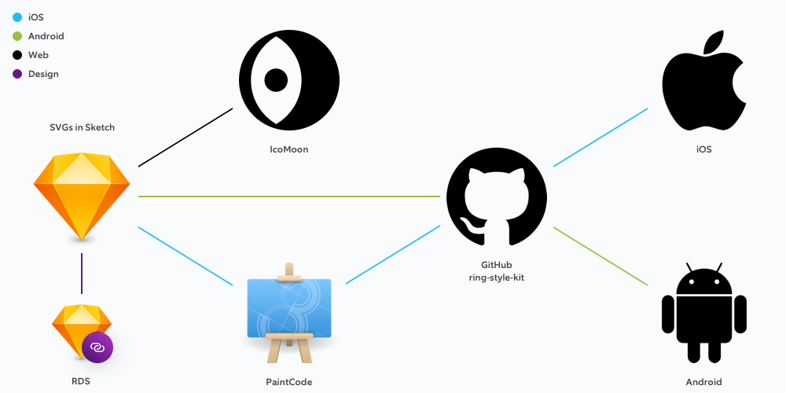

# 04 Iconography

## Basics

Our icon set's base is at 24x24 px, pt and dp. Our icons follow line icon style with exception of active state. Our line stroke weight is at 1 px, pt and dp. We Use 2 px, pt and dp padding inside the 24x24 frame.

## Workflow

**Sketch SVG**

[https://www.dropbox.com/sh/3pn4bepnmxs85rv/AADB9M3fdNmLucfKXt-5kI4Fa?dl=0](https://www.dropbox.com/sh/3pn4bepnmxs85rv/AADB9M3fdNmLucfKXt-5kI4Fa?dl=0)

**Sketch** **Ring Design System**

[https://share.goabstract.com/d0204714-e920-40ef-a1a6-d4741468e747](https://share.goabstract.com/d0204714-e920-40ef-a1a6-d4741468e747)

**IcoMoon**

[https://icomoon.io/](https://icomoon.io/)

**PaintCode**

[https://www.dropbox.com/sh/03ftllw7ps16te5/AACv8Pr-Qa0hJkDv309x7uQ3a?dl=0](https://www.dropbox.com/sh/03ftllw7ps16te5/AACv8Pr-Qa0hJkDv309x7uQ3a?dl=0)

**GitHub: ring-style-kit**

[https://github.com/EdisonJunior/ring-style-kit](https://github.com/EdisonJunior/ring-style-kit)

