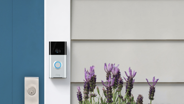

# Imagery

## Device, Silo

Device \(silo\) images have the following characteristics:

* 1:1 ratio.
* PNG, transparent.

## Device, Bundle

Device \(bundle\) images have the following characteristics:

* 1:1 ratio.
* PNG, transparent.

## Lifestyle

Lifestyle images have the following characteristics:

* 16:9 ratio.
* JPEG, nontransparent, compressed.

## POV

POV or point of view images have the following characteristics:

* 16:9 ratio.
* For designers only.
* Available in Doorbell and Cam formats.

