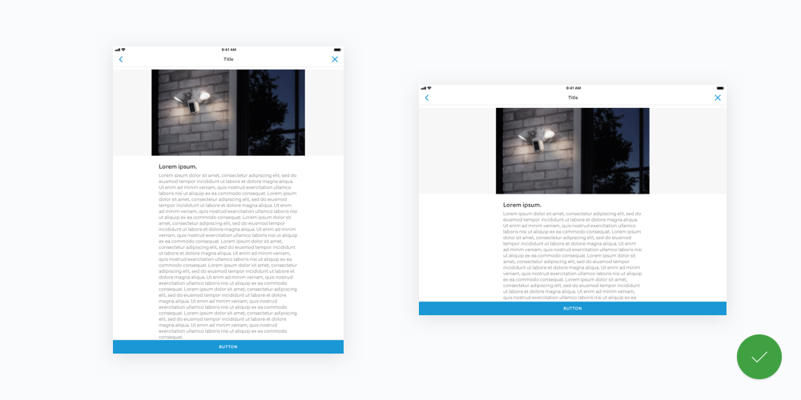

# 05 Layout - Tablet

## Problem

Designing for iPads and Tablets are not as standardized as designing for iPhones and Android phones. Although there are guidelines provided by the platform owners, the rigidity of design system can easily de-brand one's design aesthetics and principles. As a result, designing for iPads and Tablets has been fragmented in the design community.

[Apple Human Interface Guidelines - Adaptivity and Layout](https://developer.apple.com/ios/human-interface-guidelines/visual-design/adaptivity-and-layout/)

[Google Material Design Layout - Structure](https://material.io/guidelines/layout/structure.html#structure-app-bar)

## Examples

### Apple

Apple's native settings screen take the full advantage of their HIG auto layout as well as multitasking in mind. Although this approach may provide great benefits like accessibility and scalability, it would limit our design system into Apple's design system. Given the complexity of our settings screens \(e.g. Motion Zones\), our approach should keep customizability in mind.

### Spotify

Spotify's interface is built with full-width cells. Although there are cases where full-width user interface works great \(e.g. video player\), cell is **NOT** one of them. In this design, a user has a very poor experience with visually aligning the setting label and the setting value.

### Airbnb

Despite for their award-winning design system, Airbnb struggles with their cell system in the settings screens. Screen on the left showcases their use of fixed width while screen on the right showcases their use of full width like Spotify. The fixed width value is 460pt, and the area outside the cells are not intractable.

## Twitter

Taking the fixed width example of Airbnb, Twitter utilizes fixed width grid system for all screens. Unlike Airbnb, however, the area outside the cells and contents are still intractable for better user experience. The fixed width value is 516pt.

## Conclusion

Given the divided design community on the iPad and Tablet design, it is also our best interest to customize iPad and Tablet design layout rules to meet our design needs, aesthetic standards and product requirements.

## Solution

### Main Dashboard

Following the 8pt grid system, 512pt is our practice of iPad fixed width. Like Twitter, however, the area outside the 512pt grid should also be interactive with scroll functionality. \(currently in research/spike\)

### Main Dashboard - Anatomy

Inside the 512pt grid, the margin and padding rules for the cards, tiles and others persist \(e.g. 12pt or 24pt margin\).

**iOS**

[Zeplin Web](https://github.com/kevin-ring/ring-design-system/tree/8849159db6764601017289d41b84d60f348c1d98/zpl.io/2yJXMyn/README.md) / [App](zpl://screen?sid=5a720472dbbbb40b10912d80&pid=58af5866d93b58ed92ec96ed)

**Android**

[Zeplin Web](https://github.com/kevin-ring/ring-design-system/tree/8849159db6764601017289d41b84d60f348c1d98/zpl.io/aNBqvyQ/README.md) / [App](zpl://screen?sid=5a720f3a5c8a071e119344a8&pid=58af588c884d50ab92a4a9f5)

### Contents

Accessory button is still a thing for iPads. When keyboard is split, the accessory button will always remain as normal button.

**iOS**

[Zeplin Web](https://github.com/kevin-ring/ring-design-system/tree/8849159db6764601017289d41b84d60f348c1d98/zpl.io/29lMmWW/README.md) / [App](zpl://screen?sid=5a61a9b4497dcd93092e7556&pid=5a395997e8354b6a0e3b9c73)

**Android**

Zeplin Web / App

### Dialogs

The width of a dialog on iPad/Tablet becomes 464pt or dp per 512pt grid rule with 24pt margin to left and right.

**iOS**

[Zeplin Web](https://zpl.io/29lYx0Y) / [App](zpl://screen?sid=5a6f80229efae715812208d3&pid=5a395997e8354b6a0e3b9c73)

**Android**

[Zeplin Web](https://zpl.io/bAA99ze) / [App](zpl://screen?sid=5a723b8f78046f597afc499a&pid=5a39599115b7f3ec5f3326a0)

### Cells

In iPad or Tablet, cells become cards with a custom background with corner radius of 8pt and 24pt margin to the top. The width of the table is still 512pt.

**iOS**

[Zeplin Web](https://github.com/kevin-ring/ring-design-system/tree/8849159db6764601017289d41b84d60f348c1d98/zpl.io/aBjk4QK/README.md) / [App](zpl://screen?sid=5a6f90926a217f1475ef4eae&pid=5a395997e8354b6a0e3b9c73)

**Android**

Zeplin Web / App

### Cells with Contents

In iPad or Tablet, cells with other types of contents \(e.g. 16:9 asset like video or lifestyle image\) gets a \#FFFFFF background instead of \#FAFBFC background treatment to form a visual hierarchy. The whole page is scrollable, or in other words, the contents are not sticky to the top. \(currently in research/spike\)

**iOS**

[Zeplin Web](https://zpl.io/brmnYYL) / [App](zpl://screen?sid=5a7366ad05a511b13352c7a8&pid=5a395997e8354b6a0e3b9c73)

**Android**

Zeplin Web / App

### Android 7" Tablets

Android 7" tablets follows the 512dp grid rule.

**Android**

[Zeplin Web](https://zpl.io/aNBqvyQ) / [App](zpl://screen?sid=5a720f3a5c8a071e119344a8&pid=58af588c884d50ab92a4a9f5)

### Android 9" Tablets

Android 9" tablets follow the 512dp grid rule.

**Android**

[Zeplin Web](https://github.com/kevin-ring/ring-design-system/tree/8849159db6764601017289d41b84d60f348c1d98/zpl.io/V4P6noz/README.md) / [App](zpl://screen?sid=5a720f3a4f1af4bc10150dab&pid=58af588c884d50ab92a4a9f5)

### Full Width Experience

Although 512pt grid rule is applied to the majority of our design system, video players \(e.g. Live View, Scrubber, Recorded Events, Full Screen Neighborhood Post Video\) do not follow 512pt grid rule. It is the best practice to position the UI elements in the 512pt grid as much as possible, though the priority of design for screens with video player should be providing an immersive video consumption experience in full screen.

