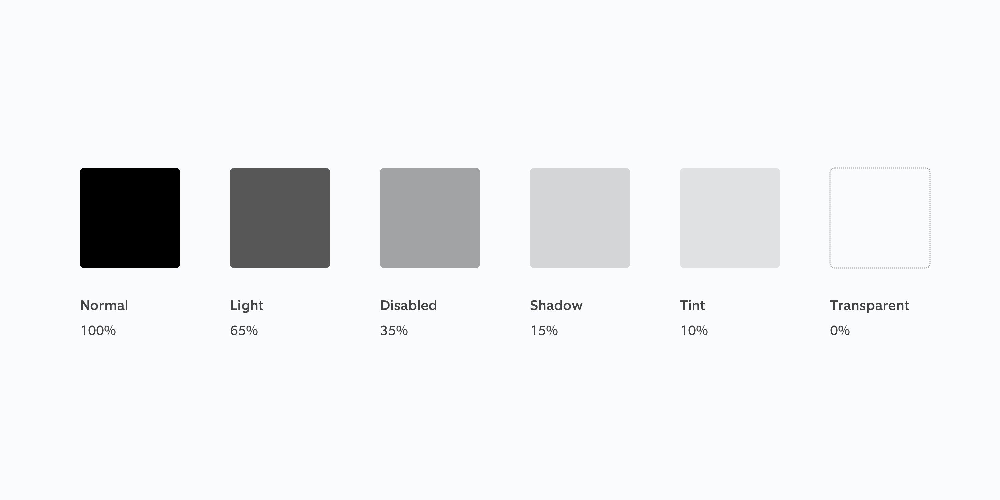

# 00-Opacity



```text
Opacity Levels

struct Opacity {
static let opacity-normal = 1.0
static let opacity-light = 0.65
static let opacity-disabled = 0.35
static let opacity-shadow-15 = 0.15
static let opacity-tint = 0.1
}
```

