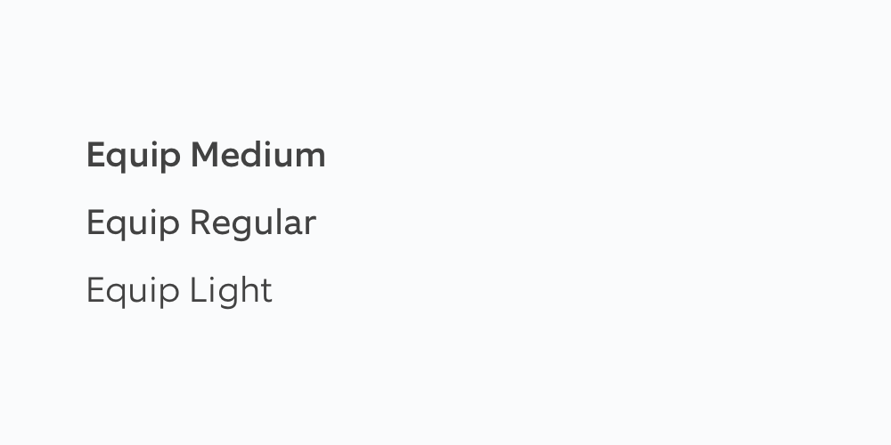
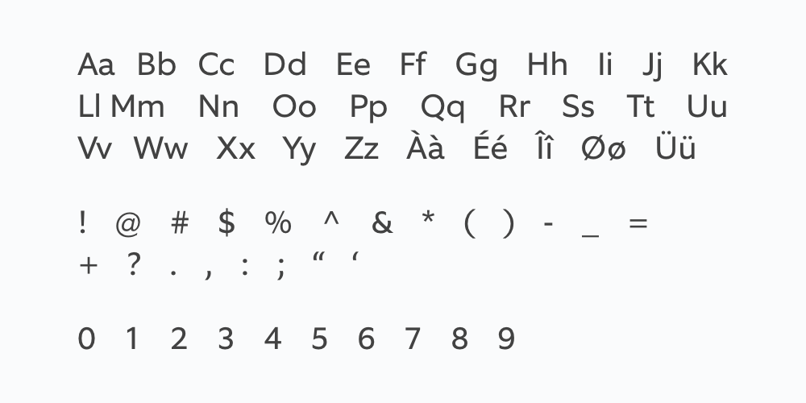
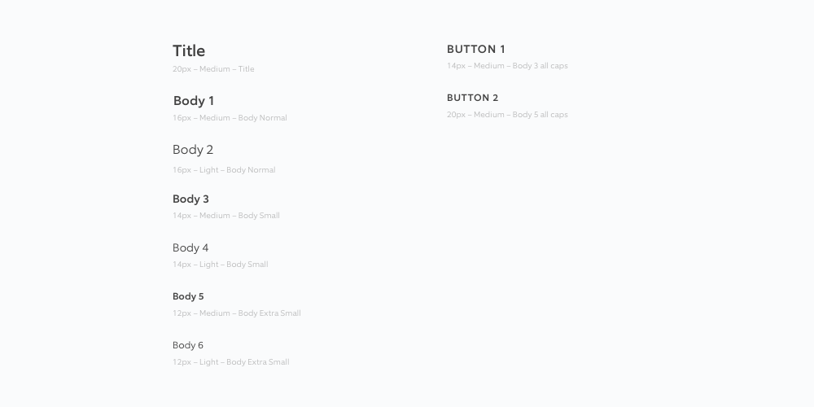
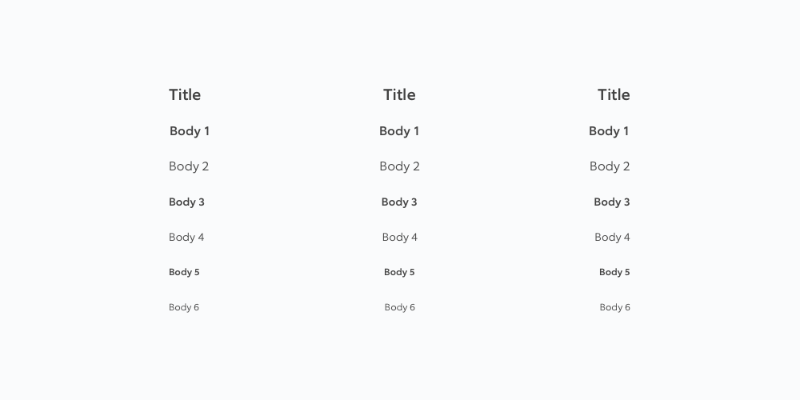
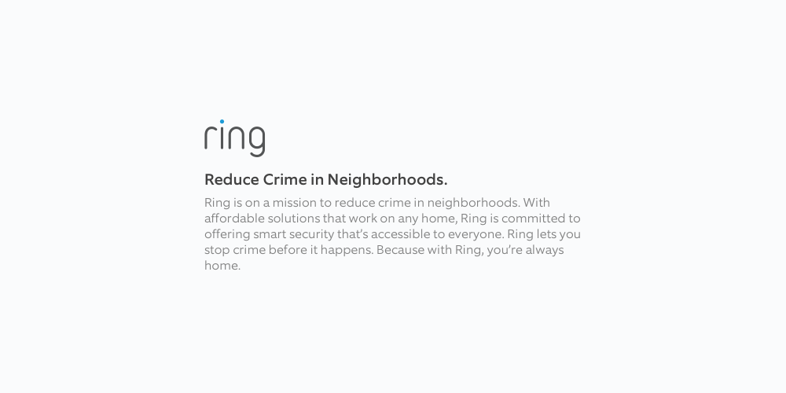

# 03 Typography

## Design











## Engineerin



```swift
extension UIFont {
  class var title: UIFont {
    return UIFont(name: "Equip-Medium", size: 20.0)!
  }
  class var body1: UIFont {
    return UIFont(name: "Equip-Medium", size: 16.0)!
  }
  class var body2: UIFont {
    return UIFont(name: "Equip-Light", size: 16.0)!
  }
  class var body3: UIFont {
    return UIFont(name: "Equip-Medium", size: 14.0)!
  }
  class var body4: UIFont {
    return UIFont(name: "Equip-Light", size: 14.0)!
  }
  class var body5: UIFont {
    return UIFont(name: "Equip-Medium", size: 12.0)!
  }
  class var body6: UIFont {
    return UIFont(name: "Equip-Light", size: 12.0)!
  }
  class var body1: UIFont {
    return UIFont(name: "Equip-Medium", size: 16.0)!
  }
  class var body1: UIFont {
    return UIFont(name: "Equip-Medium", size: 16.0)!
  }
  class var body2: UIFont {
    return UIFont(name: "Equip-Light", size: 16.0)!
  }
  class var body2: UIFont {
    return UIFont(name: "Equip-Light", size: 16.0)!
  }
  class var body3: UIFont {
    return UIFont(name: "Equip-Medium", size: 14.0)!
  }
  class var body3: UIFont {
    return UIFont(name: "Equip-Medium", size: 14.0)!
  }
  class var body4: UIFont {
    return UIFont(name: "Equip-Light", size: 14.0)!
  }
  class var body4: UIFont {
    return UIFont(name: "Equip-Light", size: 14.0)!
  }
  class var body5: UIFont {
    return UIFont(name: "Equip-Medium", size: 12.0)!
  }
  class var body5: UIFont {
    return UIFont(name: "Equip-Medium", size: 12.0)!
  }
  class var body6: UIFont {
    return UIFont(name: "Equip-Light", size: 12.0)!
  }
  class var body6: UIFont {
    return UIFont(name: "Equip-Light", size: 12.0)!
  }
}
```



```markup
<resources>
  <style name="RingThemeTextAppearanceBody2">
    <item name="android:textSize">16sp</item>
    <item name="android:lineSpacingExtra">4sp</item>
    <item name="android:textColor">@color/ring_grey_100</item>
  </style>
  <style name="RingThemeTextAppearanceTitle">
    <item name="android:textSize">20sp</item>
    <item name="android:lineSpacingExtra">4sp</item>
    <item name="android:textColor">@color/ring_grey_100</item>
  </style>
  <style name="RingThemeTextAppearanceBody1">
    <item name="android:textSize">16sp</item>
    <item name="android:lineSpacingExtra">4sp</item>
    <item name="android:textColor">@color/ring_grey_100</item>
  </style>
  <style name="RingThemeTextAppearanceBody3">
    <item name="android:textSize">14sp</item>
    <item name="android:lineSpacingExtra">6sp</item>
    <item name="android:textColor">@color/ring_grey_100</item>
  </style>
  <style name="RingThemeTextAppearanceBody4">
    <item name="android:textSize">14sp</item>
    <item name="android:lineSpacingExtra">6sp</item>
    <item name="android:textColor">@color/ring_grey_100</item>
  </style>
  <style name="RingThemeTextAppearanceBody5">
    <item name="android:textSize">12sp</item>
    <item name="android:lineSpacingExtra">8sp</item>
    <item name="android:textColor">@color/ring_grey_100</item>
  </style>
  <style name="RingThemeTextAppearanceBody6">
    <item name="android:textSize">12sp</item>
    <item name="android:lineSpacingExtra">8sp</item>
    <item name="android:textColor">@color/ring_grey_100</item>
  </style>
  <style name="RingThemeTextAppearanceBody1">
    <item name="android:gravity">center_horizontal</item>
    <item name="android:textSize">16sp</item>
    <item name="android:lineSpacingExtra">4sp</item>
    <item name="android:textColor">@color/ring_grey_100</item>
  </style>
  <style name="RingThemeTextAppearanceBody6">
    <item name="android:gravity">center_horizontal</item>
    <item name="android:textSize">12sp</item>
    <item name="android:lineSpacingExtra">8sp</item>
    <item name="android:textColor">@color/ring_grey_100</item>
  </style>
  <style name="RingThemeTextAppearanceBody5">
    <item name="android:gravity">center_horizontal</item>
    <item name="android:textSize">12sp</item>
    <item name="android:lineSpacingExtra">8sp</item>
    <item name="android:textColor">@color/ring_grey_100</item>
  </style>
  <style name="RingThemeTextAppearanceBody4">
    <item name="android:gravity">center_horizontal</item>
    <item name="android:textSize">14sp</item>
    <item name="android:lineSpacingExtra">6sp</item>
    <item name="android:textColor">@color/ring_grey_100</item>
  </style>
  <style name="RingThemeTextAppearanceBody3">
    <item name="android:gravity">center_horizontal</item>
    <item name="android:textSize">14sp</item>
    <item name="android:lineSpacingExtra">6sp</item>
    <item name="android:textColor">@color/ring_grey_100</item>
  </style>
  <style name="RingThemeTextAppearanceBody2">
    <item name="android:gravity">center_horizontal</item>
    <item name="android:textSize">16sp</item>
    <item name="android:lineSpacingExtra">4sp</item>
    <item name="android:textColor">@color/ring_grey_100</item>
  </style>
  <style name="RingThemeTextAppearanceTitle">
    <item name="android:gravity">center_horizontal</item>
    <item name="android:textSize">20sp</item>
    <item name="android:lineSpacingExtra">4sp</item>
    <item name="android:textColor">@color/ring_grey_100</item>
  </style>
  <style name="RingThemeTextAppearanceTitle">
    <item name="android:gravity">end</item>
    <item name="android:textSize">20sp</item>
    <item name="android:lineSpacingExtra">4sp</item>
    <item name="android:textColor">@color/ring_grey_100</item>
  </style>
  <style name="RingThemeTextAppearanceBody1">
    <item name="android:gravity">end</item>
    <item name="android:textSize">16sp</item>
    <item name="android:lineSpacingExtra">4sp</item>
    <item name="android:textColor">@color/ring_grey_100</item>
  </style>
  <style name="RingThemeTextAppearanceBody2">
    <item name="android:gravity">end</item>
    <item name="android:textSize">16sp</item>
    <item name="android:lineSpacingExtra">4sp</item>
    <item name="android:textColor">@color/ring_grey_100</item>
  </style>
  <style name="RingThemeTextAppearanceBody3">
    <item name="android:gravity">end</item>
    <item name="android:textSize">14sp</item>
    <item name="android:lineSpacingExtra">6sp</item>
    <item name="android:textColor">@color/ring_grey_100</item>
  </style>
  <style name="RingThemeTextAppearanceBody4">
    <item name="android:gravity">end</item>
    <item name="android:textSize">14sp</item>
    <item name="android:lineSpacingExtra">6sp</item>
    <item name="android:textColor">@color/ring_grey_100</item>
  </style>
  <style name="RingThemeTextAppearanceBody5">
    <item name="android:gravity">end</item>
    <item name="android:textSize">12sp</item>
    <item name="android:lineSpacingExtra">8sp</item>
    <item name="android:textColor">@color/ring_grey_100</item>
  </style>
  <style name="RingThemeTextAppearanceBody6">
    <item name="android:gravity">end</item>
    <item name="android:textSize">12sp</item>
    <item name="android:lineSpacingExtra">8sp</item>
    <item name="android:textColor">@color/ring_grey_100</item>
  </style>
</resources>

```



```css
@mixin Title-1MediumLeft {
  font-family: Equip;
  font-size: 40px;
  font-weight: 500;
  line-height: 1.1;
  text-align: left;
  color: $ring-grey-100;
}
@mixin Title-1LightLeft {
  font-family: Equip;
  font-size: 40px;
  font-weight: 300;
  line-height: 1.1;
  text-align: left;
  color: $ring-grey-100;
}
@mixin Title-1MediumRight {
  font-family: Equip;
  font-size: 40px;
  font-weight: 500;
  line-height: 1.1;
  text-align: right;
  color: $ring-grey-100;
}
@mixin Title-1LightCenter {
  font-family: Equip;
  font-size: 40px;
  font-weight: 300;
  line-height: 1.1;
  text-align: center;
  color: $ring-grey-100;
}
@mixin Title-1LightRight {
  font-family: Equip;
  font-size: 40px;
  font-weight: 300;
  line-height: 1.1;
  text-align: right;
  color: $ring-grey-100;
}
@mixin Title-1MediumCenter {
  font-family: Equip;
  font-size: 40px;
  font-weight: 500;
  line-height: 1.1;
  text-align: center;
  color: $ring-grey-100;
}
@mixin Title-2LightCenter {
  font-family: Equip;
  font-size: 32px;
  font-weight: 300;
  line-height: 1.13;
  text-align: center;
  color: $ring-grey-100;
}
@mixin Title-2LightRight {
  font-family: Equip;
  font-size: 32px;
  font-weight: 300;
  line-height: 1.13;
  text-align: right;
  color: $ring-grey-100;
}
@mixin Title-2LightLeft {
  font-family: Equip;
  font-size: 32px;
  font-weight: 300;
  line-height: 1.13;
  text-align: left;
  color: $ring-grey-100;
}
@mixin Title-2MediumRight {
  font-family: Equip;
  font-size: 32px;
  font-weight: 500;
  line-height: 1.13;
  text-align: right;
  color: $ring-grey-100;
}
@mixin Title-2MediumCenter {
  font-family: Equip;
  font-size: 32px;
  font-weight: 500;
  line-height: 1.13;
  text-align: center;
  color: $ring-grey-100;
}
@mixin Title-2MediumLeft {
  font-family: Equip;
  font-size: 32px;
  font-weight: 500;
  line-height: 1.13;
  text-align: left;
  color: $ring-grey-100;
}
@mixin Title-3MediumRight {
  font-family: Equip;
  font-size: 24px;
  font-weight: 500;
  line-height: 1.17;
  text-align: right;
  color: $ring-grey-100;
}
@mixin Title-3LightLeft {
  font-family: Equip;
  font-size: 24px;
  font-weight: 300;
  line-height: 1.17;
  text-align: left;
  color: $ring-grey-100;
}
@mixin Title-3MediumCenter {
  font-family: Equip;
  font-size: 24px;
  font-weight: 500;
  line-height: 1.17;
  text-align: center;
  color: $ring-grey-100;
}
@mixin Title-3LightCenter {
  font-family: Equip;
  font-size: 24px;
  font-weight: 300;
  line-height: 1.17;
  text-align: center;
  color: $ring-grey-100;
}
@mixin Title-3MediumLeft {
  font-family: Equip;
  font-size: 24px;
  font-weight: 500;
  line-height: 1.17;
  text-align: left;
  color: $ring-grey-100;
}
@mixin Body-RegularMediumLeft {
  font-family: Equip;
  font-size: 16px;
  font-weight: 500;
  line-height: 1.25;
  text-align: left;
  color: $ring-grey-100;
}
@mixin Title-3LightRight {
  font-family: Equip;
  font-size: 24px;
  font-weight: 300;
  line-height: 1.17;
  text-align: right;
  color: $ring-grey-100;
}
@mixin Body-LargeLightCenter {
  font-family: Equip;
  font-size: 20px;
  font-weight: 300;
  line-height: 1.2;
  text-align: center;
  color: $ring-grey-100;
}
@mixin Body-RegularMediumCenter {
  font-family: Equip;
  font-size: 16px;
  font-weight: 500;
  line-height: 1.25;
  text-align: center;
  color: $ring-grey-100;
}
@mixin Body-LargeMediumLeft {
  font-family: Equip;
  font-size: 20px;
  font-weight: 500;
  line-height: 1.2;
  text-align: left;
  color: $ring-grey-100;
}
@mixin Body-LargeLightLeft {
  font-family: Equip;
  font-size: 20px;
  font-weight: 300;
  line-height: 1.2;
  text-align: left;
  color: $ring-grey-100;
}
@mixin Body-LargeLightRight {
  font-family: Equip;
  font-size: 20px;
  font-weight: 300;
  line-height: 1.2;
  text-align: right;
  color: $ring-grey-100;
}
@mixin Body-RegularLightCenter {
  font-family: Equip;
  font-size: 16px;
  font-weight: 300;
  line-height: 1.25;
  text-align: center;
  color: $ring-grey-100;
}
@mixin BUTTONNORMALRIGHT-YELLOW {
  font-family: Equip;
  font-size: 14px;
  font-weight: 500;
  line-height: 1.43;
  letter-spacing: 0.8px;
  text-align: right;
  color: $ring-yellow-100;
}
@mixin Body-RegularLightLeft {
  font-family: Equip;
  font-size: 16px;
  font-weight: 300;
  line-height: 1.25;
  text-align: left;
  color: $ring-grey-100;
}
@mixin Body-RegularMediumRight {
  font-family: Equip;
  font-size: 16px;
  font-weight: 500;
  line-height: 1.25;
  text-align: right;
  color: $ring-grey-100;
}
@mixin Body-LargeMediumRight {
  font-family: Equip;
  font-size: 20px;
  font-weight: 500;
  line-height: 1.2;
  text-align: right;
  color: $ring-grey-100;
}
@mixin BUTTONNORMALRIGHT {
  font-family: Equip;
  font-size: 14px;
  font-weight: 500;
  line-height: 1.43;
  letter-spacing: 0.8px;
  text-align: right;
  color: $ring-grey-100;
}
@mixin BUTTONNORMALRIGHT-WHITE {
  font-family: Equip;
  font-size: 14px;
  font-weight: 500;
  line-height: 1.43;
  letter-spacing: 0.8px;
  text-align: right;
  color: $white-100;
}
@mixin Body-RegularLightRight {
  font-family: Equip;
  font-size: 16px;
  font-weight: 300;
  line-height: 1.25;
  text-align: right;
  color: $ring-grey-100;
}
@mixin BUTTONNORMALRIGHT-BLUE {
  font-family: Equip;
  font-size: 14px;
  font-weight: 500;
  line-height: 1.43;
  letter-spacing: 0.8px;
  text-align: right;
  color: $ring-blue-100;
}
@mixin Body-SmallMediumRight {
  font-family: Equip;
  font-size: 12px;
  font-weight: 500;
  line-height: 1.33;
  text-align: right;
  color: $ring-grey-100;
}
@mixin Body-SmallMediumLeft {
  font-family: Equip;
  font-size: 12px;
  font-weight: 500;
  line-height: 1.33;
  text-align: left;
  color: $ring-grey-100;
}
@mixin Body-SmallLightLeft {
  font-family: Equip;
  font-size: 12px;
  font-weight: 300;
  line-height: 1.33;
  text-align: left;
  color: $ring-grey-100;
}
@mixin Body-SmallMediumCenter {
  font-family: Equip;
  font-size: 12px;
  font-weight: 500;
  line-height: 1.33;
  text-align: center;
  color: $ring-grey-100;
}
@mixin Body-SmallLightCenter {
  font-family: Equip;
  font-size: 12px;
  font-weight: 300;
  line-height: 1.33;
  text-align: center;
  color: $ring-grey-100;
}
@mixin BUTTONNORMALLEFT {
  font-family: Equip;
  font-size: 14px;
  font-weight: 500;
  line-height: 1.43;
  letter-spacing: 0.8px;
  text-align: left;
  color: $ring-grey-100;
}
@mixin Body-SmallLightRight {
  font-family: Equip;
  font-size: 12px;
  font-weight: 300;
  line-height: 1.33;
  text-align: right;
  color: $ring-grey-100;
}
@mixin BUTTONNORMALLEFT-BLUE {
  font-family: Equip;
  font-size: 14px;
  font-weight: 500;
  line-height: 1.43;
  letter-spacing: 0.8px;
  text-align: left;
  color: $ring-blue-100;
}
@mixin BUTTONNORMALLEFT-YELLOW {
  font-family: Equip;
  font-size: 14px;
  font-weight: 500;
  line-height: 1.43;
  letter-spacing: 0.8px;
  text-align: left;
  color: $ring-yellow-100;
}
@mixin BUTTONNORMALLEFT-WHITE {
  font-family: Equip;
  font-size: 14px;
  font-weight: 500;
  line-height: 1.43;
  letter-spacing: 0.8px;
  text-align: left;
  color: $white-100;
}
@mixin BUTTONNORMALCENTER {
  font-family: Equip;
  font-size: 14px;
  font-weight: 500;
  line-height: 1.43;
  letter-spacing: 0.8px;
  text-align: center;
  color: $ring-grey-100;
}
@mixin BUTTONNORMALCENTER-BLUE {
  font-family: Equip;
  font-size: 14px;
  font-weight: 500;
  line-height: 1.43;
  letter-spacing: 0.8px;
  text-align: center;
  color: $ring-blue-100;
}
@mixin BUTTONNORMALCENTER-YELLOW {
  font-family: Equip;
  font-size: 14px;
  font-weight: 500;
  line-height: 1.43;
  letter-spacing: 0.8px;
  text-align: center;
  color: $ring-yellow-100;
}
@mixin BUTTONNORMALCENTER-WHITE {
  font-family: Equip;
  font-size: 14px;
  font-weight: 500;
  line-height: 1.43;
  letter-spacing: 0.8px;
  text-align: center;
  color: $white-100;
}
@mixin BUTTONSMALLLEFT {
  font-family: Equip;
  font-size: 12px;
  font-weight: 500;
  line-height: 1.67;
  letter-spacing: 0.8px;
  text-align: left;
  color: $ring-grey-100;
}
@mixin BUTTONSMALLLEFT-BLUE {
  font-family: Equip;
  font-size: 12px;
  font-weight: 500;
  line-height: 1.67;
  letter-spacing: 0.8px;
  text-align: left;
  color: $ring-blue-100;
}
@mixin BUTTONSMALLLEFT-YELLOW {
  font-family: Equip;
  font-size: 12px;
  font-weight: 500;
  line-height: 1.67;
  letter-spacing: 0.8px;
  text-align: left;
  color: $ring-yellow-100;
}
@mixin BUTTONSMALLCENTER {
  font-family: Equip;
  font-size: 12px;
  font-weight: 500;
  line-height: 1.67;
  letter-spacing: 0.8px;
  text-align: center;
  color: $ring-grey-100;
}
@mixin BUTTONSMALLLEFT-WHITE {
  font-family: Equip;
  font-size: 12px;
  font-weight: 500;
  line-height: 1.67;
  letter-spacing: 0.8px;
  text-align: left;
  color: $white-100;
}
@mixin Body-LargeMediumCenter {
  font-family: Equip;
  font-size: 20px;
  font-weight: 500;
  line-height: 1.2;
  text-align: center;
  color: $ring-grey-100;
}
@mixin BUTTONSMALLCENTER-YELLOW {
  font-family: Equip;
  font-size: 12px;
  font-weight: 500;
  line-height: 1.67;
  letter-spacing: 0.8px;
  text-align: center;
  color: $ring-yellow-100;
}
@mixin BUTTONSMALLRIGHT {
  font-family: Equip;
  font-size: 12px;
  font-weight: 500;
  line-height: 1.67;
  letter-spacing: 0.8px;
  text-align: right;
  color: $ring-grey-100;
}
@mixin BUTTONSMALLCENTER-WHITE {
  font-family: Equip;
  font-size: 12px;
  font-weight: 500;
  line-height: 1.67;
  letter-spacing: 0.8px;
  text-align: center;
  color: $white-100;
}
@mixin BUTTONSMALLRIGHT-BLUE {
  font-family: Equip;
  font-size: 12px;
  font-weight: 500;
  line-height: 1.67;
  letter-spacing: 0.8px;
  text-align: right;
  color: $ring-blue-100;
}
@mixin BUTTONSMALLCENTER-BLUE {
  font-family: Equip;
  font-size: 12px;
  font-weight: 500;
  line-height: 1.67;
  letter-spacing: 0.8px;
  text-align: center;
  color: $ring-blue-100;
}
@mixin BUTTONSMALLRIGHT-WHITE {
  font-family: Equip;
  font-size: 12px;
  font-weight: 500;
  line-height: 1.67;
  letter-spacing: 0.8px;
  text-align: right;
  color: $white-100;
}
@mixin BUTTONSMALLRIGHT-YELLOW {
  font-family: Equip;
  font-size: 12px;
  font-weight: 500;
  line-height: 1.67;
  letter-spacing: 0.8px;
  text-align: right;
  color: $ring-yellow-100;
}
@mixin BUTTONNORMALRIGHT-ORANGE {
  font-family: Equip;
  font-size: 14px;
  font-weight: 500;
  line-height: 1.43;
  letter-spacing: 0.8px;
  text-align: right;
  color: $ring-orange-100;
}
@mixin BUTTONNORMALCENTER-ORANGE {
  font-family: Equip;
  font-size: 14px;
  font-weight: 500;
  line-height: 1.43;
  letter-spacing: 0.8px;
  text-align: center;
  color: $ring-orange-100;
}
@mixin BUTTONNORMALRIGHT-RED {
  font-family: Equip;
  font-size: 14px;
  font-weight: 500;
  line-height: 1.43;
  letter-spacing: 0.8px;
  text-align: right;
  color: $ring-red-100;
}
@mixin BUTTONNORMALLEFT-RED {
  font-family: Equip;
  font-size: 14px;
  font-weight: 500;
  line-height: 1.43;
  letter-spacing: 0.8px;
  text-align: left;
  color: $ring-red-100;
}
@mixin BUTTONNORMALLEFT-ORANGE {
  font-family: Equip;
  font-size: 14px;
  font-weight: 500;
  line-height: 1.43;
  letter-spacing: 0.8px;
  text-align: left;
  color: $ring-orange-100;
}
@mixin BUTTONNORMALCENTER-GREEN {
  font-family: Equip;
  font-size: 14px;
  font-weight: 500;
  line-height: 1.43;
  letter-spacing: 0.8px;
  text-align: center;
  color: $ring-green-100;
}
@mixin BUTTONSMALLLEFT-GREEN {
  font-family: Equip;
  font-size: 12px;
  font-weight: 500;
  line-height: 1.67;
  letter-spacing: 0.8px;
  text-align: left;
  color: $ring-green-100;
}
@mixin BUTTONNORMALCENTER-RED {
  font-family: Equip;
  font-size: 14px;
  font-weight: 500;
  line-height: 1.43;
  letter-spacing: 0.8px;
  text-align: center;
  color: $ring-red-100;
}
@mixin BUTTONNORMALLEFT-GREEN {
  font-family: Equip;
  font-size: 14px;
  font-weight: 500;
  line-height: 1.43;
  letter-spacing: 0.8px;
  text-align: left;
  color: $ring-green-100;
}
@mixin BUTTONSMALLLEFT-ORANGE {
  font-family: Equip;
  font-size: 12px;
  font-weight: 500;
  line-height: 1.67;
  letter-spacing: 0.8px;
  text-align: left;
  color: $ring-orange-100;
}
@mixin BUTTONSMALLCENTER-GREEN {
  font-family: Equip;
  font-size: 12px;
  font-weight: 500;
  line-height: 1.67;
  letter-spacing: 0.8px;
  text-align: center;
  color: $ring-green-100;
}
@mixin BUTTONSMALLCENTER-ORANGE {
  font-family: Equip;
  font-size: 12px;
  font-weight: 500;
  line-height: 1.67;
  letter-spacing: 0.8px;
  text-align: center;
  color: $ring-orange-100;
}
@mixin BUTTONSMALLLEFT-RED {
  font-family: Equip;
  font-size: 12px;
  font-weight: 500;
  line-height: 1.67;
  letter-spacing: 0.8px;
  text-align: left;
  color: $ring-red-100;
}
@mixin BUTTONSMALLCENTER-RED {
  font-family: Equip;
  font-size: 12px;
  font-weight: 500;
  line-height: 1.67;
  letter-spacing: 0.8px;
  text-align: center;
  color: $ring-red-100;
}
@mixin BUTTONSMALLRIGHT-GREEN {
  font-family: Equip;
  font-size: 12px;
  font-weight: 500;
  line-height: 1.67;
  letter-spacing: 0.8px;
  text-align: right;
  color: $ring-green-100;
}
@mixin BUTTONSMALLRIGHT-ORANGE {
  font-family: Equip;
  font-size: 12px;
  font-weight: 500;
  line-height: 1.67;
  letter-spacing: 0.8px;
  text-align: right;
  color: $ring-orange-100;
}
@mixin BUTTONSMALLRIGHT-RED {
  font-family: Equip;
  font-size: 12px;
  font-weight: 500;
  line-height: 1.67;
  letter-spacing: 0.8px;
  text-align: right;
  color: $ring-red-100;
}
@mixin BUTTONNORMALRIGHT-GREEN {
  font-family: Equip;
  font-size: 14px;
  font-weight: 500;
  line-height: 1.43;
  letter-spacing: 0.8px;
  text-align: right;
  color: $ring-green-100;
}
```



## Resources

### Download

[Download Equip](https://www.dropbox.com/sh/qc8ctw71pyv8u63/AACKZ6YxA_Fhd6jyjamng5Joa?dl=0)

[Download Roboto](https://www.dropbox.com/sh/yun6kniblp755wi/AACNFFztO4sH7CMkixZPdy4Ya?dl=0)

[Download San Francisco](https://www.dropbox.com/sh/uv7l48tkdcbq276/AAD1vVbLl5RuSPuQdHAp_Bx8a?dl=0)

### Zepllin

TBA

